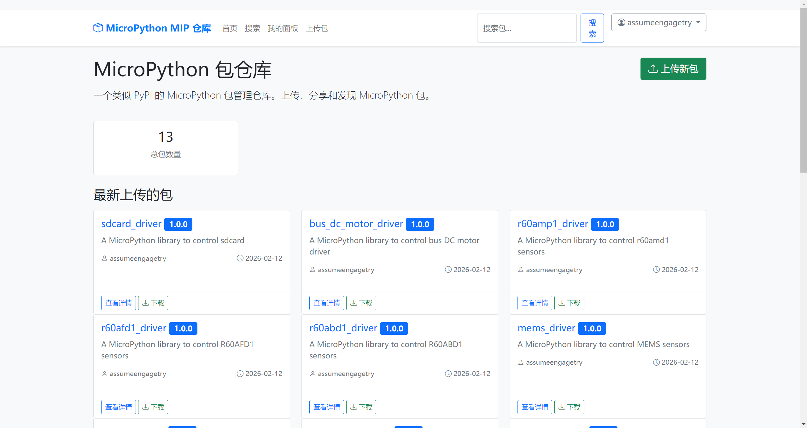
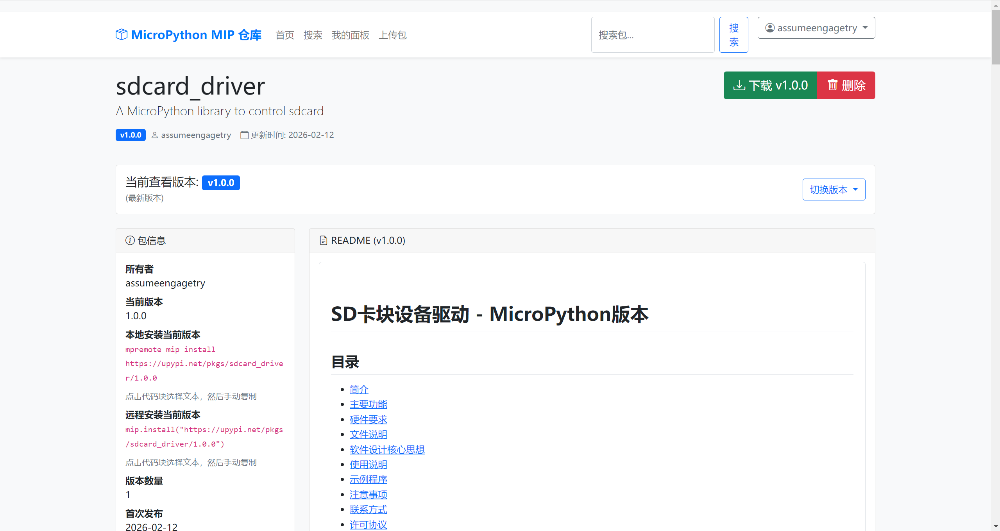
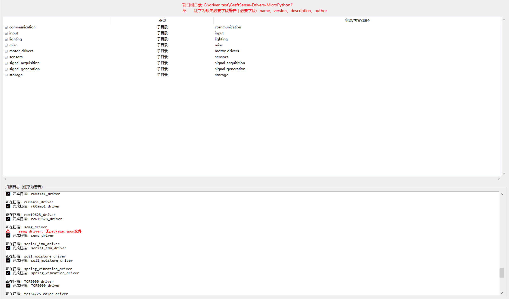
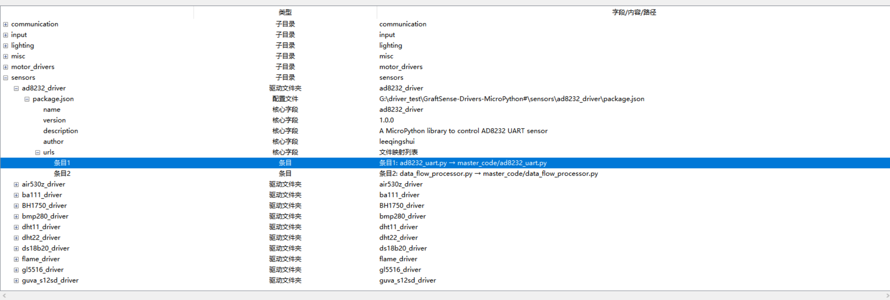
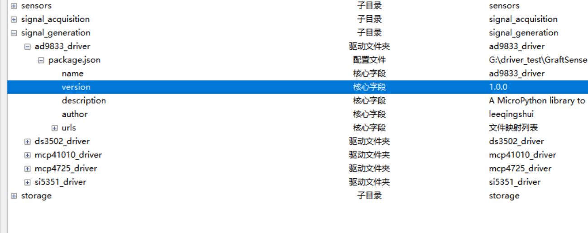
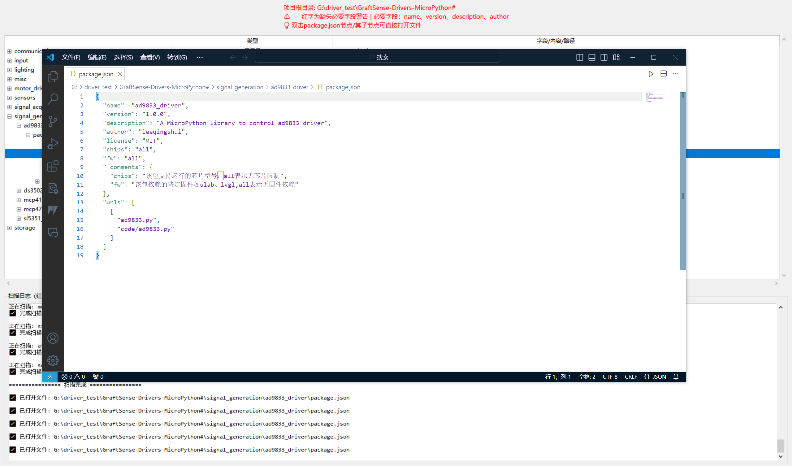
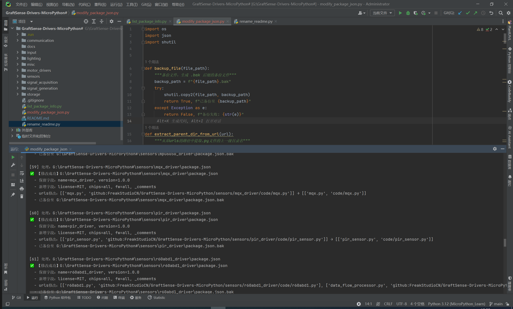
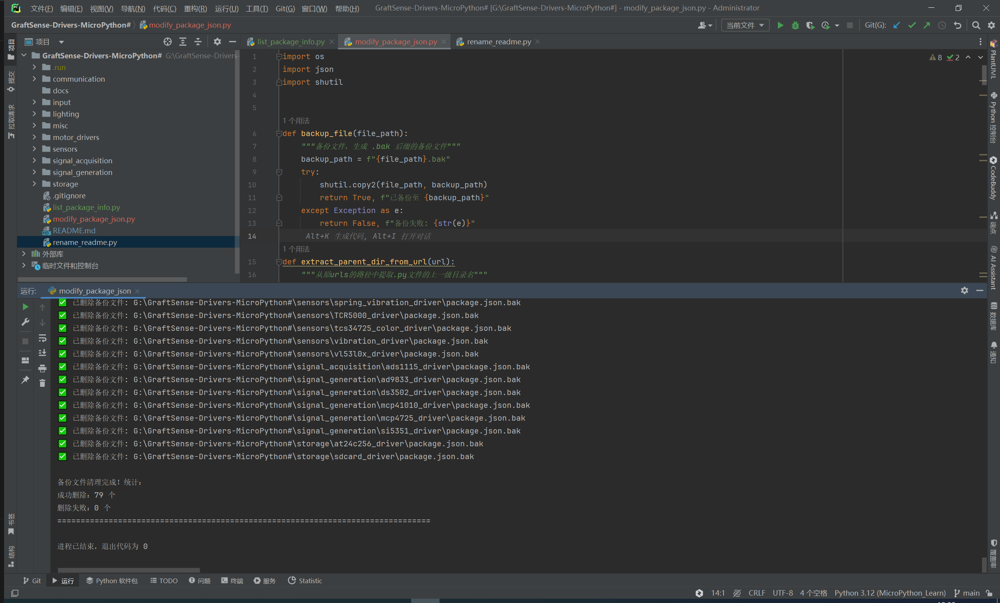

# Freak嵌入式-MicroPython中间件开源仓库

# middleware 中间件模块
该目录是micropython-embedded项目的中间件模块集合，包含audio（音频）、display（显示）、input（输入）等常用功能组件，同时`port_peripherals`子目录放置了对于ESP32、STM32、RP2等不同硬件平台相关外设/内核的特定操作。

🔗 核心资源链接:
* upypi 包源地址：https://upypi.net/
* 项目 Wiki 文档：https://freakstudio.cn/




# 📂 目录结构与模块说明

文件夹结构如下：
```
micropython-embedded/
├── middleware/          # 硬件无关的中间件层
│   ├── display/        # 显示框架（纯算法）
│   ├── input/          # 输入处理框架
│   ├── ui/             # 用户界面框架
│   ├── protocol/       # 通信协议处理
│   ├── audio/          # 音频处理（音效、合成器）
│   ├── storage/        # 存储抽象（文件、配置管理）
│   ├── network/        # 网络中间件（MQTT、WebSocket客户端）
│   ├── sensor/         # 传感器数据处理（滤波、校准）
│   └── utils/          # 通用工具库
├── port_peripherals/   # MCU特定的外设/内核等操作
│   ├── common/         # 通用抽象接口
│   ├── rp2/            # RP2040 特定外设
│   ├── stm32/          # STM32 特定外设
│   ├── esp32/          # ESP32 特定外设
│   ├── nrf/            # Nordic nRF52 系列
│   └── samd/           # SAMD21/51 系列
├── docs/               # 引用相关图片
```

# 📦 包管理与安装（支持 mip /mpremote/upypi）

所有模块均通过 package.json 标准化配置，支持多种安装方式，满足不同开发场景需求。

## 方式一：代码内通过 mip 安装（开发板联网）

适用于开发板已连接网络（如 WiFi）的场景，直接在代码中执行安装：

1. 确保开发板已烧录 MicroPython 固件（推荐 v1.23.0 及以上版本）。
2. 在代码中通过 `mip` 安装指定模块，示例：
3. python
4. 运行

```python
import mip

# 安装RCWL9623超声波模块驱动
mip.install("github:FreakStudioCN/GraftSense-Drivers-MicroPython/sensors/rcwl9623_driver")

# 安装PS2摇杆驱动
mip.install("github:FreakStudioCN/GraftSense-Drivers-MicroPython/input/ps2_joystick_driver")
```

1. 安装后直接导入使用，示例（以 TCR5000 循迹模块为例）：
2. python
3. 运行

```python
from tcr5000 import TCR5000
from machine import Pin

# 初始化模块（连接GP2引脚）
# 读取检测状态（0=检测到黑线，1=检测到白线）print("检测状态：", sensor.read())
sensor = TCR5000(Pin(2, Pin.IN))
```

## 方式二：通过 mpremote 命令行安装（开发板串口连接）

适用于开发板未联网、仅通过串口连接电脑的场景，需先安装 mpremote 工具：

步骤 1：安装 mpremote（电脑端）
```bash
# 使用pip安装mpremote
pip install mpremote
```

步骤 2：通过串口执行 mip 安装
```bash
# 简化写法（自动识别串口）
mpremote mip install github:FreakStudioCN/GraftSense-Drivers-MicroPython/input/ps2_joystick_driver
```

## 方式三：通过 upypi 包源安装（推荐）
我们提供专属 upypi 包源，访问速度更快、安装更稳定，你可以访问[**upypi网站**](https://upypi.net/)，搜索要安装的对应包的名称，打开直接复制指令在 终端运行即可：


# 🔧 开发环境准备

1. **固件烧录**：从 [MicroPython 官网](https://micropython.org/) 下载对应开发板固件（如树莓派 Pico 选择 `rp2-pico` 系列），按住 `BOOTSEL` 键连接电脑，将 `.uf2` 固件拖入识别的 U 盘完成烧录。
2. **开发工具**：推荐使用 Thonny（[thonny.org](https://thonny.org/)），支持语法高亮、串口调试和文件传输，连接后在右下角选择设备为 `MicroPython (Raspberry Pi Pico)` 即可开发。

# 辅助工具使用

仓库内置 3 个实用工具，提升开发效率：
```bash
# 1. 可视化扫描所有package.json（查看字段完整性、双击打开文件）
python list_package_info.py

# 2. 批量标准化package.json配置（自动修复urls路径、补充字段）
python modify_package_json.py

# 3. 统一文档命名（递归将所有.md文件重命名为README.md）
python rename_readme.py
```








# 📞 联系方式

Freak嵌入式工作室位以嵌入式电子套件及相关教程、成品电子模块开发、个人DIY电子作品为主要产品，致力于嵌入式教育📚和大学生创新创业比赛、电子计算机类比赛培训🧑‍💻。

**我们希望为电子DIY爱好者提供全面系统的教程和有趣的电子模块，帮助其快速完成项目相关知识学习和产品原型设计!**

- 邮箱：10696531183@qq.com
- GitHub 仓库：[https://github.com/FreakStudioCN/GraftSense-Drivers-MicroPython](https://github.com/FreakStudioCN/GraftSense-Drivers-MicroPython)

如有问题或建议，欢迎提交 Issue 或 Pull Request 参与贡献！


